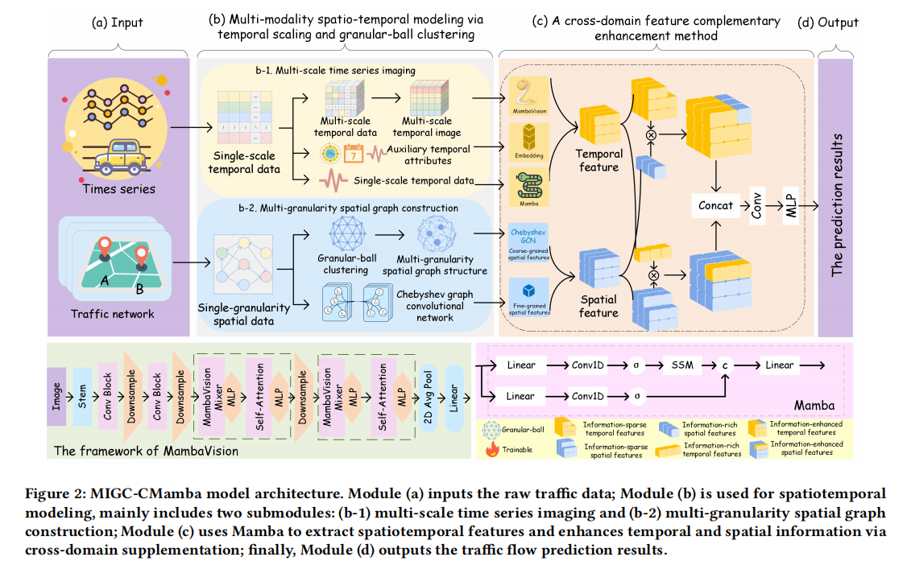

<div align="center">

# 🧠🚦 MIGC-CMamba

### Cross-Domain Mamba with Multi-Scale Imaging and Granular-Ball Computing for Traffic Flow Prediction

*A traffic flow prediction framework built on the **Mamba architecture**, combining **multi-scale time-series imaging** and **spatio-temporal feature fusion** for accurate, efficient traffic forecasting.*


</div>

---

### 🎉 News

> 🏆 **[2026]** Our paper has been **accepted at The ACM Web Conference 2026 (WWW '26)**!
> 📄 *MIGC-CMamba: Cross-Domain Mamba with Multi-Scale Imaging and Granular-Ball Computing for Traffic Flow Prediction* — [read it here](https://doi.org/10.1145/3774904.3792359)

---

## 📋 Table of Contents

- [📖 Overview](#-overview)
- [🖼️ Framework Overview](#️-framework-overview)
- [📁 Project Structure](#-project-structure)
- [⚙️ Environment Configuration](#️-environment-configuration)
- [🧩 Environment Validation](#-environment-validation)
- [🚀 Quick Start](#-quick-start)
- [📊 Results](#-results)
- [📄 Citation](#-citation)

---

## 📖 Overview

**MIGC-CMamba** unifies vision-based sequence imaging, granular-ball spatial computing, and Mamba-based cross-domain fusion into a single framework for traffic flow prediction:

- 🖼️ **Multi-scale Sequence Imaging** — converts raw traffic time series into an image modality so that **MambaVision** can jointly capture local and global temporal dependencies.
- 🔮 **Granular-Ball Spatial Graphs** — builds a multi-granularity spatial graph via granular-ball clustering, balancing macro-level trend representation with fine-grained local detail.
- 🔀 **Cross-Domain Enhancement** — adaptively fuses temporal and spatial representations to strengthen spatio-temporal dependency modeling.
- ⚡ **CUDA-accelerated** end-to-end pipeline, from preprocessing to training.
- 🏆 State-of-the-art performance over strong baselines across multiple real-world traffic datasets.

---

## 🖼️ Framework Overview

<div align="center">

</div>


---

## 📁 Project Structure

```text
.
├── mainjinan.py / mainla.py / mainbay.py / main03.py   # Main entry points for different datasets
├── data_preprocessing.py                               # Data preprocessing module
├── multiscale_processor.py                             # Multi-scale time series processing
├── spatio.py                                            # Spatial feature extraction
├── st_fusion.py                                         # Spatio-temporal fusion model
├── mamba_vision_model.py                                # Mamba-based vision model
├── trainer.py                                           # Training pipeline
├── check_environment.py                                 # Environment validation script
└── results/                                             # Output directory
    ├── dataset/                                         # PEMS03 dataset results
    └── experiment_summary.txt                           # Summary of experiments
```

---

## ⚙️ Environment Configuration

| Dependency        | Version |
|--------------------|---------|
| 🐍 Python          | 3.8.20  |
| 🔥 PyTorch         | 2.2.2   |
| 🧩 mamba-ssm       | 1.1.3   |
| 🔄 causal-conv1d   | 1.1.3   |
| 🔢 numpy           | 1.24.3  |
| 🐼 pandas          | 2.0.3   |

---

## 🧩 Environment Validation

Before running the project, please verify your environment.

**1️⃣ Create `check_environment.py`**

```python
#!/usr/bin/env python
# -*- coding: utf-8 -*-
"""
Environment Validation Script for Traffic Flow Prediction Project
Based on Mamba Architecture
---------------------------------------------------------------
Verifies that all dependencies are correctly installed and accessible.
"""

import sys
import torch
import numpy as np
import pandas as pd


def check_environment():
    print("🔍 Checking environment configuration...\n")

    try:
        import mamba_ssm
        import causal_conv1d

        print("✅ All dependencies are installed correctly!\n")
        print(f"🐍 Python version: {sys.version.split()[0]}")
        print(f"🔥 PyTorch version: {torch.__version__}")
        print(f"🧩 mamba-ssm version: {getattr(mamba_ssm, '__version__', 'unknown')}")
        print(f"🔄 causal-conv1d version: {getattr(causal_conv1d, '__version__', 'unknown')}")
        print(f"🔢 numpy version: {np.__version__}")
        print(f"📊 pandas version: {pd.__version__}")

        # CUDA info
        print("\n💻 CUDA information:")
        print(f"CUDA available: {torch.cuda.is_available()}")
        if torch.cuda.is_available():
            print(f"CUDA version: {torch.version.cuda}")
            device_id = torch.cuda.current_device()
            print(f"Current device ID: {device_id}")
            print(f"Device name: {torch.cuda.get_device_name(device_id)}")

        print("\n✅ Environment check completed successfully!")

    except ImportError as e:
        print(f"❌ Missing dependency: {e}")
        sys.exit(1)


if __name__ == "__main__":
    check_environment()
```

**2️⃣ Run validation**

```bash
python check_environment.py
```

---

## 🚀 Quick Start

Run the model on your dataset of choice:

```bash
python mainjinan.py --data_path /project/data/Jinan/JiNan.npz
python mainbay.py --dataset_dir /project/data/pems-bay/
python mainbay.py --dataset_dir /project/data/metr-la/
python main03.py
```

> ⚠️ Double-check the `metr-la` line above — since `mainla.py` also exists as its own entry point, confirm whether that dataset should be run via `mainbay.py` or `mainla.py` in your setup.

---

## 📊 Results

| | |
|---|---|
| 📂 **Output folder** | `results/dataset` |
| 📄 **Summary file**  | `results/experiment_summary.txt` |

> 📈 Per-run metrics (e.g. MAE / RMSE / MAPE) are written to the summary file above after training completes.

---

## 📄 Citation

If you find this work useful, please consider citing our paper 🙏

```bibtex
@inproceedings{10.1145/3774904.3792359,
author = {Chang, Wenxia and Zhang, Chao and Li, Wentao and Li, Deyu},
title = {MIGC-CMamba: Cross-Domain Mamba with Multi-Scale Imaging and Granular-Ball Computing for Traffic Flow Prediction},
year = {2026},
isbn = {9798400723070},
publisher = {Association for Computing Machinery},
address = {New York, NY, USA},
url = {https://doi.org/10.1145/3774904.3792359},
doi = {10.1145/3774904.3792359},
booktitle = {Proceedings of the ACM Web Conference 2026},
pages = {7167–7177},
numpages = {11},
keywords = {traffic flow prediction, multi-scale imaging, granular-ball computing, mamba, cross-domain enhancement},
location = {United Arab Emirates},
series = {WWW '26}
}
```

<details>
<summary>📝 Click to view the full abstract</summary>
<br>

With the increasing relevance of web mining and content analysis in uncovering mobility patterns from large-scale online data, traffic flow prediction plays a crucial role in proactive urban planning and enhancing the responsiveness of intelligent transportation systems. However, existing traffic flow prediction methods often fail to explicitly capture correlations in continuous multivariate sequences that are naturally suited for trend and periodic pattern extraction by vision models and rely on fixed spatial graphs that neglect the cognitive advantages of granular-ball structures, which limits their ability to model interactions and strengthen spatiotemporal dependencies. To address these challenges, this paper proposes a Cross-domain Mamba framework that integrates Multi-scale Imaging and Granular-ball Computing for traffic flow prediction (MIGC-CMamba). First, a multi-scale sequence imaging method is presented, which converts the original time series into image modality and leverages MambaVision to capture both local and global dependencies. Second, a multi-granularity spatial graph is constructed via granular-ball clustering, which balances global trend representation and local detail preservation. Third, a cross-domain enhancement mechanism adaptively integrates temporal and spatial domains, strengthening spatiotemporal dependencies. Lastly, extensive experiments demonstrate superior performance over state-of-the-art baselines, highlighting how vision-based imaging, cognition-inspired granular-ball modeling, and content-aware mining jointly advance the modeling of spatiotemporal dependencies in traffic flow prediction.

</details>


</div>
